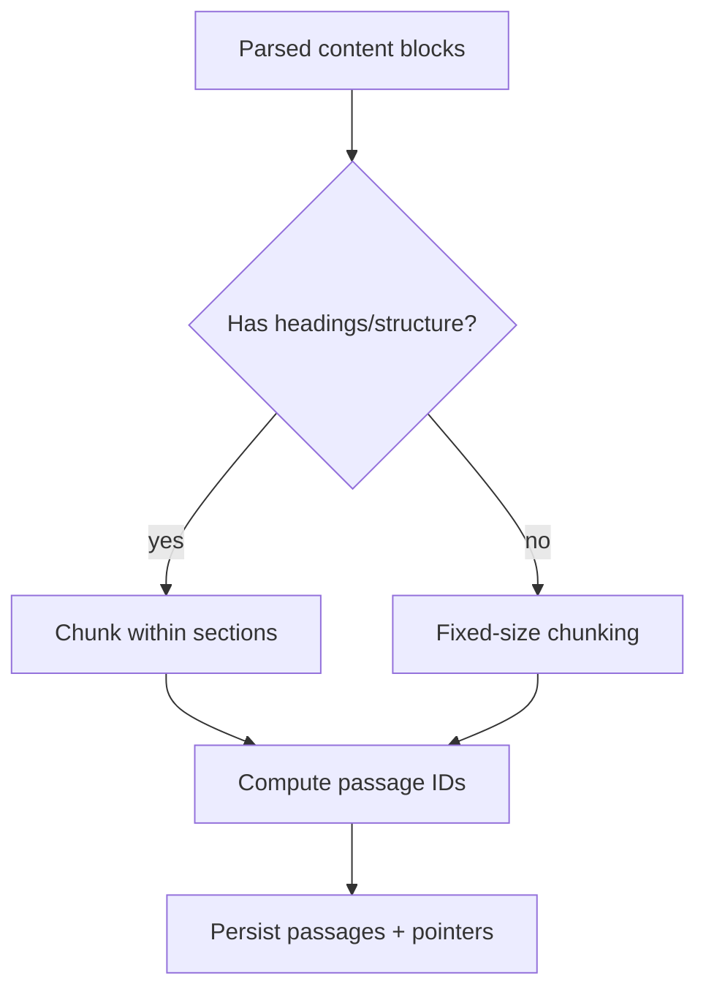
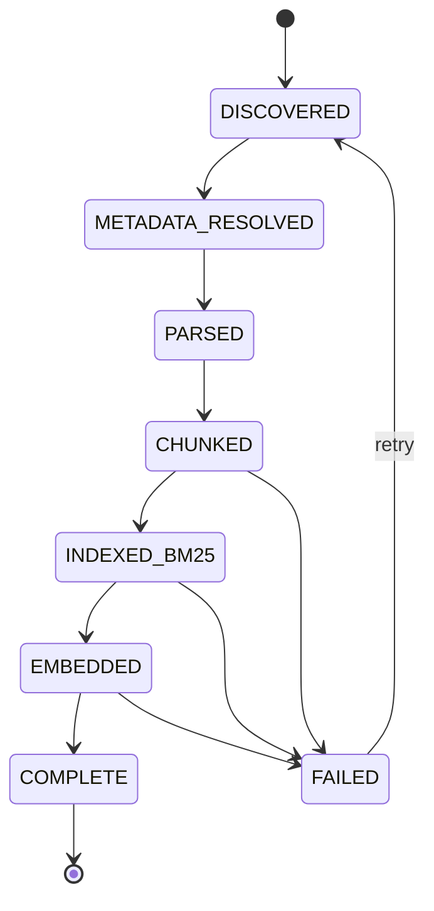

# Ingestion Pipeline

This document describes the ingestion pipeline for **OpenITI Discovery**: how the OpenITI RELEASE corpus is processed into structured passages, indexed into OpenSearch and Qdrant, and linked to relational metadata in PostgreSQL.

The pipeline is designed for:

* **full-corpus indexing** (entire OpenITI RELEASE)
* **subset indexing** for development
* **checkpointed**, **resumable execution**
* CPU-only operation for development and GPU acceleration for embeddings when available

---

## Overview

### Inputs

* OpenITI RELEASE repository mounted read-only
* OpenITI metadata CSVs (from RELEASE repo)
* Optional: precomputed embeddings (future extension)

### Outputs

* PostgreSQL rows for authors/works/versions/passages + ingest state
* OpenSearch documents for BM25 search + filtering + highlighting
* Qdrant vectors for semantic retrieval

---

## Pipeline Flow

```mermaid
flowchart TD
  A[OpenITI RELEASE mounted at CORPUS_ROOT] --> B[Scan metadata CSVs]
  B --> C[Load/Upsert metadata into PostgreSQL]
  A --> D[Enumerate text files under data/]
  D --> E[Resolve file -> version/work/author via metadata]
  E --> F[Parse OpenITI mARkdown structure]
  F --> G[Normalize Arabic-script text]
  G --> H["Chunk into passages (~300 words)"]
  H --> I[Compute stable passage IDs]
  I --> J[Upsert passages + pointers into PostgreSQL]
  J --> K[Index passages into OpenSearch]
  K --> L[Generate embeddings (CPU/GPU)]
  L --> M[Upsert vectors into Qdrant]
  M --> N[Mark ingest complete/checkpoint]
```

--- 

## Execution Modes

The ingest container supports two common modes:

**Full Mode**

* Intended for complete corpus indexing
* Runs until completion (hours to days depending on hardware and embedding model)

**Subset Mode**

* Intended for development and iteration
* Restricts ingest to a small set of works/versions/languages

---

## Running Ingest

### Full Copus Ingest

```
docker compose --profile ingest run --rm ingest
```

### Subset Ingest (example)

Set environment variables (via .env, compose overrides, or your shell):

```env
INGEST_MODE=subset
INGEST_ONLY_PRI=true
INGEST_LANGS=ara,fas
INGEST_WORK_LIMIT=500
EMBEDDING_DEVICE=cpu
CHUNK_TARGET_WORDS=300
```

Then run:

```
docker compose --profile ingest run --rm ingest
```

---

## Configuration

### Required Environment Variables

| Variable                  |                    Example | Description                  |
| ------------------------- | -------------------------: | ---------------------------- |
| `CORPUS_ROOT`             |          `/corpus/RELEASE` | Path to mounted RELEASE repo |
| `DATABASE_URL`            | `postgresql+psycopg://...` | PostgreSQL connection string |
| `OPENSEARCH_URL`          |   `http://opensearch:9200` | OpenSearch endpoint          |
| `OPENSEARCH_INDEX_CHUNKS` |           `openiti_chunks` | Alias or index name          |
| `QDRANT_URL`              |       `http://qdrant:6333` | Qdrant endpoint              |
| `QDRANT_COLLECTION`       |           `openiti_chunks` | Qdrant collection name       |

### Ingest Controls

| Variable                  |       Default | Description                                          |
| ------------------------- | ------------: | ---------------------------------------------------- |
| `INGEST_MODE`             |        `full` | `full` or `subset`                                   |
| `INGEST_ONLY_PRI`         |        `true` | Index only primary versions by default               |
| `INGEST_LANGS`            | `ara,fas,ota` | Comma-separated language codes                       |
| `INGEST_WORK_LIMIT`       |           `0` | Limit number of works (subset mode). `0` = no limit  |
| `CHUNK_TARGET_WORDS`      |         `300` | Target passage size in words                         |
| `CHUNK_MAX_OVERLAP_WORDS` |           `0` | Optional overlap for recall (usually 0 initially)    |
| `SKIP_EXISTING`           |        `true` | Skip already indexed passages based on checkpointing |


### Embedding Controls

| Variable               |        Default | Description                                   |
| ---------------------- | -------------: | --------------------------------------------- |
| `EMBEDDING_DEVICE`     |          `cpu` | `cpu` or `cuda`                               |
| `EMBEDDING_BATCH_SIZE` |           `64` | Embedding batch size                          |
| `EMBEDDING_MODEL`      | `multilingual` | Embedding model identifier (project-defined)  |
| `EMBEDDING_DIM`        |            `0` | Optional explicit dim; `0` = infer from model |
| `EMBEDDING_PRECISION`  |         `fp32` | `fp32` or `fp16` (GPU-friendly)               |

---

## Detailed Steps

### Step 1: Load Metadata

The pipeline reads OpenITI RELEASE metadata (CSV) and stores it in PostgreSQL. This provides:

* stable identifiers (author/work/version)
* language flags
* PRI designation (where available)
* bibliographic facets (dates, genres, tags)

**Behavior**

* Upsert by stable IDs (avoid duplicates)
* Track source CSV revision (optional but recommended)


---

## Step 2: Enumerate Text Files

The pipeline walks the RELEASE directory tree and identifies candidate text files.

**Typical filtering**

* Ignore non-text artifacts
* Optionally restrict to `PRI` versions
* Restrict by language selection (`INGEST_LANGS`)

Outputs a stream of “version ingest tasks”.

---

### Step 3. Parse OpenITI mARkdown

OpenITI mARkdown includes structural markers that can improve chunking and UI display (e.g., headings).

Parsing extracts:

* section headings (for breadcrumbs)
* milestone markers (when present)
* content blocks

This is not TEI; treat it as a pragmatic structure layer.

--- 

## Step 4: Normalize Text (Arabic-script)

Normalization is applied for indexing and embeddings, not for preserving the raw corpus.

The pipeline should retain:

* `text_raw` (exact file segment)
* `text_norm` (normalized for search + embedding)

Typical normalization actions:

* remove tatweel (ـ)
* remove harakat/diacritics
* normalize alef variants
* normalize Persian letter variants (ک/ك, ی/ي)
* normalize hamza variants conservatively

---

## Step 5: Chunk Into Passages

The pipeline chunks text into passages roughly aligned to “page-ish” size.

**Default target**

* ~300 words (`CHUNK_TARGET_WORDS=300`)

**Boundary preference**

1. Use structural boundaries (headings/sections) when available
2. Else use fixed-size segmentation with word counts
3. Optionally preserve milestone boundaries if present

## Each passage stores:

* `passage_id` (stable)
* `chunk_index` (order in version)
* `heading_path` (breadcrumbs)
* `text_raw`, `text_norm`
* neighbor IDs (`prev_id`, `next_id`)



---

## Step 6: Assign Stable Passage IDs

Passage IDs must be stable across reindexing so that:

* citations remain valid
* UI deep links remain stable
* reuse edges remain meaningful

Recommended ID components:

* `version_id`
* `chunk_index` or milestone position
* optional hash for validation

Example formats:

* `version:{version_id}:chunk:{n}`
* `{version_id}::{n}`

---

## Step 7: Persist to PostgreSQL

Passage metadata is upserted into PostgreSQL.

This includes:

* passage identifiers
* offsets/order within version
* headings
* raw/norm text pointers (optional: store full text in OpenSearch only)

**Design choice**

* For very large scale, store full text primarily in OpenSearch and store only pointers in Postgres.
* For local-first simplicity, it’s acceptable to store text_raw in Postgres initially, but expect bloat.

---

## Step 8: Index to OpenSearch (BM25)

Each passage becomes an OpenSearch document.

Fields typically include:

* `chunk_id`
* `work_id`, `version_id`, `author_id`
* `lang`
* `is_pri`
* `title`
* `content` (multi-field analyzers)

OpenSearch index should be created from an index template (see `opensearch/templates/...`).

---

## Step 9: Generate Embeddings

Embeddings are generated from text_norm for semantic search. The embedding stage may run:

* inline during ingest (simpler)
* or as a second pass (more robust for long runs)

**Device selection**

* CPU for subset indexing
* GPU for full indexing if available

Batching controls performance and memory use.

---

## Step 10: Upsert to Qdrant

Vectors are upserted into Qdrant with payload metadata:

* `chunk_id`
* `work_id`, `version_id`, `author_id`
* `lang`, `is_pri`
* optional: `chunk_index`

Qdrant collection configuration should match embedding dimensionality and distance metric.

---

## Step 11: Checkpointing and Resume

The ingest must be resumable.

Recommended checkpoint strategy:

* PostgreSQL table ingest_state keyed by `version_id`
* Track:
    * last completed step (parsed, chunked, indexed, embedded)
    * last processed `chunk_index`
    * timestamps and error status
* On startup:
    * skip completed versions unless forced
    * continue incomplete ones from last safe boundary



---

## Recommended Operational Approach

### For Development

* index `PRI` only
* cap work count (e.g., 200–2000)
* CPU embeddings or skip embeddings
* iterate on analyzers and chunking

## For Full Corpus

* run embeddings on GPU
* store ingestion logs and checkpoints on persistent volume
* consider staging embeddings separately if you want “BM25 available quickly”

---

## Troubleshooting

### OpenSearch index creation fails

Common causes:

* ICU analyzer configured but ICU plugin not installed
* mismatched index template vs OpenSearch version
* memory too low for OpenSearch JVM heap

Fix:

* remove ICU analyzer OR install plugin
* confirm template applied to correct index_patterns
* increase heap (`OPENSEARCH_JAVA_OPTS`)

---

### Ingest is slow

Common causes:

* embedding model too large for CPU
* too many OpenSearch refreshes
* too small embedding batches

Fix:

* set `refresh_interval` higher during ingest (e.g., `30s`), then reset to `1s`
* batch OpenSearch bulk indexing
* increase `EMBEDDING_BATCH_SIZE` (GPU) or decrease if OOM

---

### Memory usage explodes

Common causes:

* holding entire file in memory
* large embedding batches
* too many parallel workers

Fix:

* stream file parsing
* reduce parallelism
* batch and flush frequently

---

### Resume doesn’t work

Common causes:

* checkpoint not written frequently enough
* passage IDs not stable
* changes in chunking parameters

Fix:

* checkpoint per version and per chunk batch
* avoid changing chunking parameters mid-run (or reindex cleanly)

---

## Validation and Smoke Tests

Minimum sanity checks after ingest:

1. PostgreSQL counts match expectations:
    * number of versions ingested
    * number of passages created
2. OpenSearch:
    * can query by keyword and filter by language
* highlighting returns expected snippets
3. Qdrant:
    * can retrieve nearest neighbors for a known passage
4. API:
    * hybrid query returns results and metadata fields are populated

---

## Future Extensions

* Phrase reuse detection (reuse graph edges stored in PostgreSQL)
* Named entity extraction and entity-level facets
* Incremental corpus update ingest (git revision tracking)